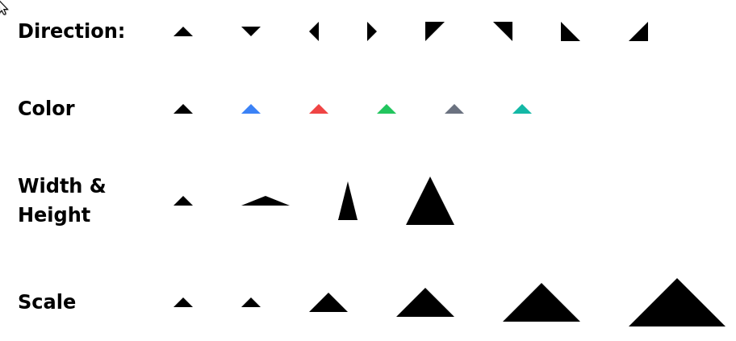

<div align="center">

# @tailwindash/triangle

[![npm.badge]][npm] [![bundlephobia.badge]][bundlephobia] [![Tailwind Play][tailwind.play.badge]][tailwind.play]

Tailwind plugin for building triangles with border attributes.

[][tailwind.play]

</div>

## Table of Contents

- [@tailwindash/triangle](#tailwindashtriangle)
  - [Table of Contents](#table-of-contents)
  - [`tailwindash`](#tailwindash)
  - [Installation](#installation)
  - [Quick Start](#quick-start)
  - [Documentation](#documentation)
    - [Direction Abbreviation](#direction-abbreviation)
    - [Class Names](#class-names)
    - [Sizing & Scaling](#sizing--scaling)
  - [Customization](#customization)
  - [Changelog](#changelog)

## `tailwindash`

This package is part of the [@tailwindash][github.monorepo] family. For contributing guideline and more, refer to its [readme][github.monorepo].

## Installation

1. Make sure you have [tailwind] setup for your project.

2. Install `@tailwindash/triangle`

   ```bash
   npm install -D @tailwindash/triangle
   ```

   ```bash
   pnpm add -D @tailwindash/triangle
   ```

   ```bash
   yarn add -D @tailwindash/triangle
   ```

3. Add plugin to tailwind config file

   ```javascript
   /** @type {import("tailwindcss").Config } */
   const config = {
     plugins: [require('@tailwindash/triangle')],
   };

   module.exports = config;
   ```

## Quick Start

See [![Tailwind Play][tailwind.play.badge]][tailwind.play]. For more customization, see below [Documentation](#documentation).

## Documentation

### Direction Abbreviation

| Direction    | Abbreviation |
| ------------ | ------------ |
| top          | `t`          |
| bottom       | `b`          |
| left         | `l`          |
| right        | `r`          |
| top left     | `tl`         |
| top right    | `tr`         |
| bottom left  | `bl`         |
| bottom right | `br`         |

### Class Names

| Class name       | Values                                                       | Type      | Group     | Required | Description                     |
| ---------------- | ------------------------------------------------------------ | --------- | --------- | -------- | ------------------------------- |
| `triangle`       |                                                              | component |           | yes      | base class                      |
| `triangle-...`   | one of {`t`, `b`, `l`, `r`, `tl`, `tr`, `bl`, `br` }         | utility   | direction | yes      | placement direction             |
| `triangle-...`   | as in [tailwind's color][tailwind.color]                     | utility   | color     | no       | color                           |
| `triangle-...`   | integer from `1` to `10`, or as [customized](#customization) | utility   | scale     | no       | see [Scaling](#sizing--scaling) |
| `triangle-w-...` | as in [tailwind's width][tailwind.width]                     | utility   | size      | no       | `width`                         |
| `triangle-h-...` | as in [tailwind's height][tailwind.height]                   | utility   | size      | no       | `height`                        |

### Sizing & Scaling

Depending on the direction, triangle will have the following default width & height

| Direction                | Width    | Height   |
| ------------------------ | -------- | -------- |
| `triangle-{t,b}`         | `1rem`   | `0.5rem` |
| `triangle-{l,r}`         | `0.5rem` | `1rem`   |
| `triangle-{tl,tr,bl,br}` | `1rem`   | `1rem`   |

> ⚠️ Scaling is done by applying [css's `calc()`][css.calc] to width and height, not `transform: scale(...)`

For example:

```html
<div class="triangle triangle-t triangle-w-5 triangle-h-10 triangle-3"></div>
<!-- The calculation below assumes tailwind's default config -->
<!-- w-5 = 1.25rem -->
<!-- h-10 = 2.5rem -->
<!-- scaling factor = 3 -->
<!-- => triangle width = 1.25rem * 3 -->
<!-- => triangle height = 2.5rem * 3 -->
```

Below is the default support for scaling. Extend `triangle` if customization is needed (see [Customization](#customization)).

```javascript
/** @type {import("tailwindcss").Config } */
const config = {
  theme: {
    triangle: {
      1: '1',
      2: '2',
      3: '3',
      4: '4',
      5: '5',
      6: '6',
      7: '7',
      8: '8',
      9: '9',
      10: '10',
    },
  },
};
```

## Customization

This plugin respects your tailwind config, including `prefixes`.

For customization of the scaling factor, set or extend the `triangle` object. Make sure to have a valid factor for [css's `calc()`][css.calc].

```javascript
/** @type {import("tailwindcss").Config } */
const config = {
  theme: {
    extend: {
      triangle: {
        '1/2': '1/2',
        20: '20',
      },
    },
  },
  plugins: [require('@tailwindash/triangle')],
};

module.exports = config;
```

## [Changelog][github.changelog]

<p align="center">
  <a href="https://www.buymeacoffee.com/vnphanquang" target="_blank">
    
  </a>
</p>

[github.monorepo]: https://github.com/vnphanquang/tailwindash
[github.changelog]: https://github.com/vnphanquang/tailwindash/blob/main/packages/plugins/triangle/CHANGELOG.md

<!-- heading badge -->

[npm.badge]: https://img.shields.io/npm/v/@tailwindash/triangle
[npm]: https://www.npmjs.com/package/@tailwindash/triangle
[bundlephobia.badge]: https://img.shields.io/bundlephobia/minzip/@tailwindash/triangle?label=minzipped
[bundlephobia]: https://bundlephobia.com/package/@tailwindash/triangle
[tailwind]: https://tailwindcss.com/
[tailwind.width]: https://tailwindcss.com/docs/width
[tailwind.height]: https://tailwindcss.com/docs/height
[tailwind.color]: https://tailwindcss.com/docs/customizing-colors
[tailwind.play.badge]: https://img.shields.io/static/v1?label=&message=Tailwind+Play&logo=tailwind-css&logoColor=fff&color=38bdf8
[tailwind.play]: https://play.tailwindcss.com/1suQXtVfJO
[css.calc]: https://developer.mozilla.org/en-US/docs/Web/CSS/calc
